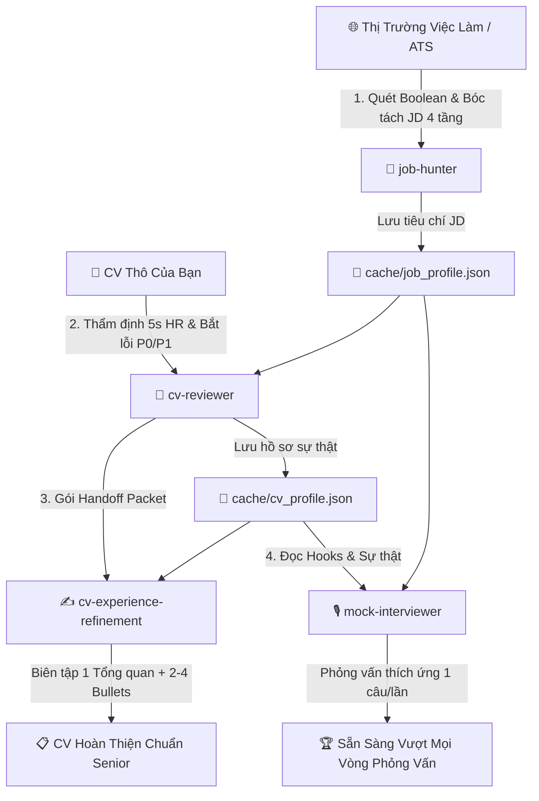

# 📘 SỔ TAY HƯỚNG DẪN SỬ DỤNG TRỌN BỘ TECH CAREER AI SUITE

> **Hệ sinh thái AI Sự nghiệp Toàn diện:** Săn việc đa kênh ATS • Thẩm định CV chuẩn Tech Lead • Tái cấu trúc Kinh nghiệm 100% Chống Bịa Đặt • Luyện phỏng vấn Đối kháng 3 Trục.

---

## 📑 MỤC LỤC

1. [Tổng Quan 4 Siêu Skill & Sơ Đồ Khép Kín](#1-tổng-quan-4-siêu-skill--sơ-đồ-khép-kín)
2. [Cơ Chế Cache Dữ Liệu JSON Tự Động (`cache/`)](#2-cơ-chế-cache-dữ-liệu-json-tự-động)
3. [Hướng Dẫn Chi Tiết Từng Skill & Câu Lệnh Mẫu](#3-hướng-dẫn-chi-tiết-từng-skill--câu-lệnh-mẫu)
   - [🏹 Skill 1: job-hunter — Săn Việc & Soạn Thư Outreach](#-skill-1-job-hunter--săn-việc--soạn-thư-outreach)
   - [🎯 Skill 2: cv-reviewer — Thẩm Định & Bắt Lỗi CV 5 Giây](#-skill-2-cv-reviewer--thẩm-định--bắt-lỗi-cv-5-giây)
   - [✍️ Skill 3: cv-experience-refinement — Tái Cấu Trúc Kinh Nghiệm](#-skill-3-cv-experience-refinement--tái-cấu-trúc-kinh-nghiệm)
   - [🎙️ Skill 4: mock-interviewer — Phỏng Vấn Đối Kháng Tech Lead](#-skill-4-mock-interviewer--phỏng-vấn-đối-kháng-tech-lead)
4. [Mẫu Thư Ngỏ & Email Direct Outreach Gửi TMA Solutions & Ecotek](#4-mẫu-thư-ngỏ--email-direct-outreach-gửi-tma-solutions--ecotek)
5. [Quy Trình Ứng Tuyển 4 Bước Chuẩn Senior](#5-quy-trình-ứng-tuyển-4-bước-chuẩn-senior)
6. [Bảo Mật Dữ Liệu & Quy Tắc Không Bịa Đặt (Anti-Hallucination)](#6-bảo-mật-dữ-liệu--quy-tắc-không-bịa-đặt)

---

## 1. TỔNG QUAN 4 SIÊU SKILL & SƠ ĐỒ KHÉP KÍN

Hệ thống hoạt động với 4 tác nhân AI chuyên biệt, phối hợp nhịp nhàng theo chu trình khép kín:



---

## 2. CƠ CHẾ CACHE DỮ LIỆU JSON TỰ ĐỘNG

Dự án chuẩn hóa **duy nhất định dạng JSON** trong thư mục `cache/` để bạn **không bao giờ phải nạp lại CV hay JD nhiều lần**:

* **`cache/cv_profile.json`**: Lưu toàn bộ hồ sơ năng lực, bằng cấp, kỹ năng, các dự án đã phân vai trò (*Trụ cột / Bằng chứng / Bổ sung / Xóa*), sự thật khả dụng (*Available Facts*) và các điểm đào sâu phỏng vấn (*Interview Hooks*).
* **`cache/job_profile.json`**: Lưu bài toán cốt lõi của JD, các yêu cầu cứng (*Must-have*), điểm cộng (*Nice-to-have*) và bộ từ khóa chuyên ngành.
* **`cache/interview_session.json`**: Lưu tiến trình hỏi đáp, cờ cảnh báo mâu thuẫn và điểm số 3 trục qua các buổi luyện phỏng vấn.

---

## 3. HƯỚNG DẪN CHI TIẾT TỪNG SKILL & CÂU LỆNH MẪU

---

### 🏹 Skill 1: `job-hunter` — Săn Việc & Soạn Thư Outreach

#### Chức năng:
* Sinh chuỗi tìm kiếm Boolean nâng cao quét thẳng vào các cổng ATS toàn cầu: **Lever, Greenhouse, Ashby, Workday, SmartRecruiters, LinkedIn, ITviec, TopCV**.
* Bóc tách JD thành 4 tầng (*Hard Reqs, Nice-to-have, Responsibilities, Cultural Signals*).
* Đối sánh năng lực 7 chiều dựa trên bằng chứng, phát hiện **Hard Blockers** (vị trí yêu cầu 5+ năm YOE hoặc sai lệch địa lý).

#### Câu lệnh mẫu để copy vào chat:
```text
Hãy sử dụng job-hunter để tạo chuỗi Boolean search tìm kiếm các vị trí Junior/Fresher Embedded Software Engineer (C/C++, ESP32, FreeRTOS, MQTT) tại khu vực TP. Hồ Chí Minh trên các nền tảng ITviec, LinkedIn và TopCV. Sau đó đối sánh trực tiếp với hồ sơ trong cache/cv_profile.json.
```

---

### 🎯 Skill 2: `cv-reviewer` — Thẩm Định & Bắt Lỗi CV 5 Giây

#### Chức năng:
* **Thử thách 5 giây của Recruiter**: Chấm điểm xem nhà tuyển dụng có nắm bắt được năng lực cốt lõi trong 5 giây quét mắt đầu tiên hay không.
* **Định tuyến ứng viên 2 trục**: Phân loại cấp độ (`Khởi đầu / Tăng trưởng / Bứt phá`) và mật độ hồ sơ.
* **Bắt lỗi phân cấp P0 / P1 / P2**: Chỉ rõ vị trí lỗi, tác động tuyển dụng và cách sửa trực tiếp.
* **Phân bổ vai trò kinh nghiệm**: Gán nhãn `Trụ cột (Pillar)`, `Bằng chứng (Proof)`, `Bổ sung (Supplement)`, `Xóa bỏ (Delete)`.

#### Câu lệnh mẫu để copy vào chat:
```text
Hãy sử dụng cv-reviewer để thẩm định bản CV này đối chiếu với yêu cầu của TMA Solutions trong cache/job_profile.json. Xác định cấp độ ứng viên, phân tích các lỗi P0/P1, phân bổ vai trò kinh nghiệm và xuất gói bàn giao tinh chỉnh cv-experience-refinement.
```

---

### ✍️ Skill 3: `cv-experience-refinement` — Tái Cấu Trúc Kinh Nghiệm

#### Chức năng:
* Tái cấu trúc từng dự án theo mô hình chuẩn: **`1 dòng Tổng quan bài toán` + `2–4 Bullets kỹ thuật chuyên sâu`** *(System Design, Technical Depth, Reliability, Delivery)*.
* **100% Anti-Hallucination**: Tuyệt đối không tự bịa đặt số liệu hay công nghệ. Tự động chèn thẻ placeholder `[CẦN XÁC NHẬN: ...]` để bạn điền số liệu đo lường thực tế.
* **Chống Fake Seniorize**: Không tự nâng cấp "Implemented" thành "Architected/Led" nếu không có bằng chứng.

#### Câu lệnh mẫu để copy vào chat:
```text
Hãy sử dụng cv-experience-refinement để viết lại 2 dự án Trụ cột: Camera-AI và Xparking_Auto. Tuân thủ nghiêm ngặt nguyên tắc Bảo toàn sự thật (Available Facts), giữ nguyên các điểm Interview Hooks và tự động chèn thẻ [CẦN XÁC NHẬN: ...] cho các thông số đo lường.
```

---

### 🎙️ Skill 4: `mock-interviewer` — Phỏng Vấn Đối Kháng Tech Lead

#### Chức năng:
* Đóng vai **Tech Lead / Hiring Manager khó tính**, phỏng vấn trực tiếp **1 câu/lượt**.
* **Động cơ thích ứng (Adaptive Difficulty 1–5)**: Trả lời tốt sẽ tăng độ khó và hỏi sâu vào Edge Cases/Trade-offs; trả lời mơ hồ sẽ bị xoáy sâu và yêu cầu làm rõ.
* **Phát hiện nói quá (Bluff & Contradiction Detection)**: Cắm cờ `⚠️ CV/Evidence Mismatch` nếu câu trả lời mâu thuẫn với dữ liệu CV.
* **Mô phỏng sự cố Production**: Đưa ra kịch bản sự cố hệ thống theo từng nấc manh mối.
* **Báo cáo điểm 3 trục**: Chấm điểm *Chiều sâu kỹ thuật (0-10), Giao tiếp (0-10), Tư duy giải quyết vấn đề (0-10)* và đưa ra kết luận tuyển dụng (*Strong Hire → No Hire*).

#### Các lệnh kích hoạt nhanh (Slash Commands):
* `/mock-interview full`: Phỏng vấn toàn diện 7 bước (Warm-up → CV Defense → Deep Technical → System Design → Scenario → Pressure Test → Báo cáo).
* `/mock-interview technical`: Bỏ qua giới thiệu, đi thẳng vào C/C++, Concurrency, FreeRTOS, MQTT và Quản lý bộ nhớ.
* `/mock-interview cv-defense`: Thẩm tra tính xác thực các dự án trong CV, bắt chứng minh quyền quyết định thiết kế.
* `/mock-interview pressure`: Thử thách áp lực 60 giây và xử lý sự cố Production.
* `/mock-interview weaknesses`: Khoan sâu vào các điểm thiếu số liệu hoặc lỗi P0/P1.

#### Câu lệnh mẫu để copy vào chat:
```text
/mock-interview full
Hãy đóng vai Tech Lead phỏng vấn tôi cho vị trí Embedded Firmware Developer tại TMA Solutions. Sử dụng dữ liệu trong cache/cv_profile.json và cache/job_profile.json, hỏi tôi từng câu một và điều chỉnh độ khó thích ứng.
```

---

## 4. MẪU THƯ NGỎ & EMAIL DIRECT OUTREACH GỬI TMA SOLUTIONS & ECOTEK

Dưới đây là 2 mẫu thư tiếp cận trực tiếp chuẩn Senior do `job-hunter` thiết kế riêng cho hồ sơ của **Nguyễn Thành Phúc**, nhắm trúng các dự án thực chiến và bằng chứng đã kiểm chứng:

---

### ✉️ Mẫu 1: Gửi HR / Engineering Manager — TMA Solutions

**Tiêu đề Email:** `[Ứng Tuyển] Kỹ Sư Lập Trình Nhúng / C++ Developer — Nguyễn Thành Phúc (Tốt nghiệp loại Giỏi, ĐH Gia Định)`

```text
Kính gửi Bộ phận Tuyển dụng & Ban Quản lý Kỹ thuật TMA Solutions,

Tôi tên là Nguyễn Thành Phúc, vừa tốt nghiệp loại Giỏi chuyên ngành Kỹ thuật Nhúng tại Đại học Gia Định (đạt Học bổng Merit). Qua tìm hiểu các dự án IoT và hệ thống nhúng của TMA Solutions phục vụ đối tác quốc tế, tôi nhận thấy định hướng kỹ thuật của quý công ty rất phù hợp với nền tảng thực chiến của tôi.

Trong quá trình học tập và đảm nhiệm vai trò Trưởng nhóm Kỹ thuật CLB IoT GDU, tôi đã trực tiếp phát triển và chuẩn hóa mã nguồn mở cho 4 dự án thực tế trên GitHub:
1. Camera-AI (Trụ cột): Hệ thống giám sát giao thông tích hợp camera vi điều khiển ESP32-S3 (stream video MJPEG) với mạch ESP32 PCB Controller điều khiển đèn tín hiệu thời gian thực qua giao thức MQTT và pipeline thị giác máy tính YOLOv8.
2. Xparking_Auto: Hệ thống quản lý 4 cổng bãi xe tự động áp dụng kiến trúc Đa luồng (Multi-threading) với threading.Lock và threading.Event chống race condition, giao tiếp nền qua MQTT với vi điều khiển ESP32 đóng/mở barrier.
3. Kỹ năng debug phần cứng thực tế: Thành thạo đo kiểm tín hiệu bus UART/SPI/I2C bằng Máy hiện sóng (Oscilloscope) và Bộ phân tích logic (Logic Analyzer).

Với nền tảng C/C++ vững chắc, tư duy xử lý đồng thời và khả năng làm chủ từ tầng cứng vi điều khiển đến tầng giao tiếp mạng, tôi tin rằng mình có thể nhanh chóng hòa nhập và đóng góp hiệu quả vào các dự án nhúng tại TMA Solutions.

Tôi xin gửi kèm CV và liên kết mã nguồn các dự án để Quý công ty tiện tham khảo:
- GitHub cá nhân: https://github.com/Phuc710
- Dự án tiêu biểu: https://github.com/Phuc710/Camera-AI

Rất mong có cơ hội được trao đổi trực tiếp với Quý công ty trong một buổi phỏng vấn kỹ thuật.

Trân trọng,
Nguyễn Thành Phúc
Số điện thoại: 0793617300 | Email: phucnguyenn710@gmail.com
```

---

### ✉️ Mẫu 2: Gửi Tech Lead / HR — Ecotek Vietnam

**Tiêu đề Email:** `[Application] IoT Firmware Engineer (ESP32 / MQTT) — Nguyen Thanh Phuc`

```text
Kính gửi Ban Tuyển dụng & Tech Lead Ecotek Vietnam,

Tôi viết thư này để bày tỏ nguyện vọng ứng tuyển vào vị trí IoT Firmware Engineer (ESP32 / MQTT) tại Ecotek Vietnam. Với kinh nghiệm chuyên sâu về lập trình C/C++ trên vi điều khiển ESP32/ESP32-S3 và thiết kế kiến trúc truyền thông MQTT cho các giải pháp đô thị thông minh, tôi nhận thấy năng lực của mình hoàn toàn khớp với bài toán kỹ thuật mà Ecotek đang phát triển.

Một số điểm nhấn kỹ thuật nổi bật trong hồ sơ của tôi:
• Lập trình Firmware ESP32 & Giao thức MQTT: Đã xây dựng trọn vẹn hệ thống telemetry Smart_Waste sử dụng ESP32 thu thập dữ liệu cảm biến định kỳ và nhúng Aedes MQTT Broker xử lý dữ liệu thời gian thực.
• Xử lý Đồng thời & Hệ thống Tin cậy: Triển khai thành công kiến trúc đa luồng kiểm soát thiết bị ngoại vi và xử lý luồng dữ liệu liên tục trong dự án Xparking_Auto và Camera-AI.
• Gỡ lỗi Phần cứng Chuyên sâu: Có kinh nghiệm đo kiểm dạng sóng, phân tích bus I2C/SPI/UART bằng Logic Analyzer và Oscilloscope để cô lập lỗi phần cứng.

Tôi rất ấn tượng với các giải pháp Smart City mà Ecotek đang triển khai và mong muốn được cống hiến năng lực lập trình nhúng của mình cho sản phẩm của công ty.

Quý công ty có thể xem chi tiết các dự án và chất lượng code của tôi tại: https://github.com/Phuc710

Xin chân thành cảm ơn Quý công ty đã dành thời gian xem xét hồ sơ.

Trân trọng,
Nguyễn Thành Phúc | 0793617300 | phucnguyenn710@gmail.com
```

---

## 5. QUY TRÌNH ỨNG TUYỂN 4 BƯỚC CHUẨN SENIOR

Để đạt tỷ lệ phỏng vấn và nhận offer cao nhất, hãy thực hiện theo đúng quy trình 4 bước sau:

```
┌────────────────────────────────────────────────────────────────────────┐
│ BƯỚC 1: SĂN JD & ĐỐI SÁNH NĂNG LỰC (Dùng job-hunter)                   │
│ - Quét danh sách JD mục tiêu, bóc tách 4 tầng và kiểm tra Hard Blockers│
│ - Tự động ghi nhận bài toán tuyển dụng vào cache/job_profile.json      │
├────────────────────────────────────────────────────────────────────────┤
│ BƯỚC 2: THẨM ĐỊNH & BẮT LỖI CV (Dùng cv-reviewer)                      │
│ - Kiểm tra quy tắc 5 giây của Recruiter, phân bổ vai trò Trụ cột       │
│ - Sửa toàn bộ lỗi chí mạng P0/P1, cập nhật cache/cv_profile.json       │
├────────────────────────────────────────────────────────────────────────┤
│ BƯỚC 3: TÁI CẤU TRÚC KINH NGHIỆM (Dùng cv-experience-refinement)       │
│ - Viết lại các dự án Trụ cột theo mô hình 1 Tổng quan + 2-4 Bullets    │
│ - Điền số liệu đo lường thực tế vào các thẻ [CẦN XÁC NHẬN: ...]        │
├────────────────────────────────────────────────────────────────────────┤
│ BƯỚC 4: LUYỆN PHỎNG VẤN & GỬI OUTREACH (Dùng mock-interviewer & Outreach)│
│ - Gõ /mock-interview full để luyện phản xạ với Tech Lead ảo            │
│ - Gửi Email Direct Outreach kèm link GitHub tới Hiring Manager         │
└────────────────────────────────────────────────────────────────────────┘
```

---

## 6. BẢO MẬT DỮ LIỆU & QUY TẮC KHÔNG BỊA ĐẶT

1. **Bảo Mật Cá Nhân 100%**: Toàn bộ file CV (`*.pdf`, `*.html`, `*.docx`) và thư mục `cache/` đã được cấu hình chặt chẽ trong `.gitignore`. Khi bạn đẩy code lên GitHub cá nhân, **không có bất kỳ dữ liệu nhạy cảm nào bị rò rỉ**.
2. **Nguyên Tắc Bất Biến (Anti-Hallucination Guard)**: Mọi câu chữ xuất ra từ hệ thống đều trung thành tuyệt đối với sự thật bạn đã làm. Không bao giờ tự chém số liệu ảo `%`, lượng người dùng hay công nghệ chưa từng chạm vào.

---

<div align="center">

**Tech Career AI Suite — Vũ Khí Tối Thượng Nâng Tầm Sự Nghiệp Kỹ Sư Công Nghệ**

⭐ *Chúc bạn tự tin chinh phục vị trí Kỹ sư Nhúng tại TMA Solutions và các tập đoàn hàng đầu!* ⭐

</div>
