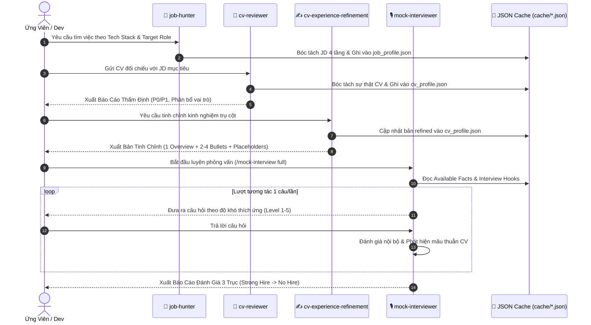

<div align="center">

# 🚀 Tech Career AI Suite — `cv-reviewer`, `cv-experience-refinement`, `mock-interviewer` & `job-hunter`

### Hệ sinh thái AI Sự nghiệp Toàn diện: Săn việc đa kênh ATS • Thẩm định CV chuẩn Tech Lead • Tái cấu trúc Kinh nghiệm • Phỏng vấn Đối kháng 3 Trục
**Multi-ATS Boolean Search • 4-Tier JD Deconstruction • 5s HR Audit • Experience Refinement • AI Mock Interview • JSON Profile Caching**

[](https://agentskills.io/specification)
[](https://github.com)
[](https://agentskills.io)
[](LICENSE)
[](https://github.com)

[Tổng Quan](#-tổng-quan-hệ-thống) •
[4 Siêu Skill Cốt Lõi](#-4-siêu-skill-cốt-lõi) •
[Cơ Chế JSON Cache](#-cơ-chế-cache-dữ-liệu-json-duy-nhất) •
[Sơ Đồ Hoạt Động](#-luồng-quy-trình-khép-kín-end-to-end-workflow) •
[Cài Đặt & Lệnh Mẫu](#-cài-đặt-nhanh--câu-lệnh-mẫu) •
[Đóng Góp](#-đóng-góp--phát-triển-contributing)

---

</div>

## 🌟 Tổng Quan Hệ Thống

Repository này cung cấp một **Hệ sinh thái AI Sự nghiệp Khép kín (End-to-End AI Career Suite)** dành cho Kỹ sư Công nghệ, Lập trình viên và Tech Talents. Hệ thống bao phủ toàn bộ vòng đời ứng tuyển: từ **săn việc chủ động đa kênh ATS, bóc tách JD 4 tầng, thẩm định CV 5 giây, tái cấu trúc kinh nghiệm 100% chống bịa đặt đến luyện phỏng vấn đối kháng với Tech Lead ảo**.

Hệ thống hoạt động với **4 cỗ máy AI chuyên biệt kết nối chặt chẽ**:
1. 🏹 **`job-hunter`**: Săn lùng JD mục tiêu qua mọi cổng ATS toàn cầu (Lever, Greenhouse, Ashby, Workday, LinkedIn), bóc tách yêu cầu 4 tầng và phân tích khoảng cách năng lực (Gap Analysis).
2. 🎯 **`cv-reviewer`**: Đóng vai trò Hội đồng tuyển dụng & Tech Lead, thẩm định từng dòng kinh nghiệm, bắt lỗi chí mạng P0/P1, kiểm tra quy tắc 5 giây của Recruiter và ép lưu cache JSON.
3. ✍️ **`cv-experience-refinement`**: Tiếp nhận Handoff Packet để tái cấu trúc từng dự án thành mô hình chuẩn *(1 dòng Tổng quan + 2–4 Bullets chuyên sâu)*, tuân thủ 100% nguyên tắc **Bảo toàn sự thật (Anti-Hallucination)**.
4. 🎙️ **`mock-interviewer`**: Đóng vai **Tech Lead / Hiring Manager khó tính**, thực hiện phỏng vấn đối kháng theo cơ chế thích ứng (Adaptive Difficulty), mô phỏng sự cố Production và đánh giá 3 trục *(Technical Depth, Communication, Problem Solving)*.

---

## ⚡ 4 Siêu Skill Cốt Lõi

```
                       ┌────────────────────────────────────────────────────────┐
                       │           TECH CAREER AI AGENT WORKSPACE               │
                       └───────────────────┬────────────────────────────────────┘
                                           │
         ┌─────────────────┬───────────────┴───────────────┬─────────────────┐
         ▼                 ▼                               ▼                 ▼
  ┌──────────────┐  ┌──────────────┐                ┌──────────────┐  ┌──────────────┐
  │🏹 job-hunter │  │🎯 cv-reviewer│                │✍️ cv-refine  │  │🎙️ mock-interv│
  ├──────────────┤  ├──────────────┤                ├──────────────┤  ├──────────────┤
  │• Boolean ATS │  │• 5s HR Audit │                │• 1 Overview  │  │• 5 Modes     │
  │• 4-Tier JD   │  │• 2-Axis Tier │ ──[cache/]──►  │  + 2-4 Bullet│  │• Adaptive Diff│
  │• Gap Analysis│  │• P0/P1/P2    │                │• Anti-Halluc │  │• Production  │
  │• Outreach    │  │• Role Part   │                │• Placeholders│  │• 3-Axis Score│
  └──────────────┘  └──────────────┘                └──────────────┘  └──────────────┘
```

### 1. 🏹 `job-hunter` — Săn Việc & Nghiên Cứu Thị Trường Chuẩn Senior
* **Boolean Search Playbook**: Sinh tự động chuỗi tìm kiếm nâng cao quét vào các cổng ATS: **Lever, Greenhouse, Ashby, Workday, SmartRecruiters, LinkedIn X-Ray, ITviec, TopCV**.
* **4-Tier JD Deconstruction**: Bóc tách JD 4 tầng (*Hard Requirements, Nice-to-have, Responsibilities, Cultural Signals*).
* **Evidence-Based Matching**: Đối sánh năng lực 5 cấp độ (*Claim → Evidence → Source → Timestamp → Confidence*) và phát hiện *Negative Evidence*.
* **Bản đồ thị trường Tech Việt Nam**: Phân khúc Tier 1 Global/Chip/Automotive, Tier 2 Product/IoT, Tier 3 Outsourcing.

### 2. 🎯 `cv-reviewer` — Thẩm Định & Tái Cấu Trúc Hồ Sơ Năng Lực
* **Quy tắc 5 Giây Recruiter**: Kiểm tra độ thu hút và khả năng định vị năng lực trong 5 giây đầu.
* **Bảng phân cấp lỗi P0 / P1 / P2**: Bắt lỗi chí mạng (P0: sai lệch thời gian, thiếu bối cảnh), lỗi cạnh tranh (P1: thiếu số liệu, từ ngữ chung chung).
* **Phân bổ vai trò kinh nghiệm (Role Partitioning)**: Gán nhãn `Trụ cột (Pillar)`, `Bằng chứng (Proof)`, `Bổ sung (Supplement)` hoặc `Xóa bỏ (Delete)`.
* **Từ điển ngành & Interview Hooks**: Bộ từ vựng kỹ thuật chuẩn Tech Lead và các điểm đào sâu phỏng vấn.

### 3. ✍️ `cv-experience-refinement` — Biên Tập Trải Nghiệm (100% Anti-Hallucination)
* **Khung 2 Tầng Chuẩn Mực**: 1 dòng Tổng quan trả lời *"Dự án giải quyết bài toán gì?"* + 2–4 Gạch đầu dòng kỹ thuật chuyên sâu *(System Design, Technical Depth, Reliability, Delivery)*.
* **Quy Tắc Bất Biến (Facts Are Immutable)**:
  * Tuyệt đối không tự ý bịa đặt số liệu %, người dùng, quy mô đội ngũ hay công nghệ mới.
  * Tự động chèn thẻ `[CẦN XÁC NHẬN: ...]` vào các vị trí cần ứng viên điền số liệu đo lường thực tế.
  * Chống "Fake Seniorize": Không biến `Implemented` thành `Architected` hay `Led team` nếu không có bằng chứng.
* **3 Chế Độ Đầu Ra**: `final` (hoàn thiện), `enhanced-draft` (bản thảo kèm thẻ xác nhận), `incomplete` (liệt kê câu hỏi truy vấn).

### 4. 🎙️ `mock-interviewer` — Phỏng Vấn Đối Kháng & Đánh Giá 3 Trục
* **5 Chế Độ Phỏng Vấn**: `full-mock` (toàn diện 7 bước), `technical-deep-dive` (chuyên sâu kỹ thuật), `cv-defense` (thẩm tra hồ sơ), `pressure-test` (áp lực 60s), `weakness-drill` (khoan vào điểm yếu).
* **Động Cơ Thích Ứng (Adaptive Engine)**: Tự động tăng/giảm độ khó (Level 1 Fundamental → Level 5 Tech Lead) dựa trên câu trả lời thực tế.
* **Mô Phỏng Sự Cố Production**: Đưa ra sự cố hệ thống theo từng nấc manh mối (Alert → Triage → Clues → Root Cause & Prevention).
* **Đánh Giá 3 Trục Chuẩn Xác**: Chấm điểm độc lập *(Technical Depth, Communication, Problem Solving 0-10)* và xuất kết luận *(Strong Hire → No Hire)*.

---

## 💾 Cơ Chế Cache Dữ Liệu JSON Duy Nhất

| File Cache | Nội Dung Lưu Trữ | Lợi Ích Thực Tế |
|---|---|---|
| **`cache/cv_profile.json`** | Toàn bộ sự thật đã xác thực (*Available Facts*), cấp độ ứng viên, danh sách kỹ năng, phân loại kinh nghiệm, Interview Hooks và trường mở rộng `refinement`. | Khi ứng tuyển JD mới, AI Agent **đọc trực tiếp từ file này**, không cần tải lại file CV thô. |
| **`cache/job_profile.json`** | Bài toán trọng tâm của JD, tiêu chí bắt buộc (*Must-have*), điểm cộng (*Nice-to-have*), từ khóa kỹ thuật. | Nhanh chóng thử nghiệm nhiều phương án điều chỉnh kinh nghiệm với cùng một JD. |
| **`cache/interview_session.json`** | Tiến trình các lượt hỏi đáp, đánh giá nội bộ theo lượt, cờ cảnh báo mâu thuẫn và điểm số tích lũy. | Giúp theo dõi sự tiến bộ qua từng buổi luyện phỏng vấn. |

---

## 🔄 Luồng Quy Trình Khép Kín (End-to-End Workflow)



---

## 🚀 Cài Đặt Nhanh & Câu Lệnh Mẫu

### 1. Cài đặt tự động qua [`skills` CLI](https://github.com/vercel-labs/skills)

```bash
# Cài đặt trọn bộ 4 skills cho Antigravity, Cursor, Claude Code, Codex, OpenClaw
npx skills add StariverKang/cv-reviewer --skill cv-reviewer --skill cv-experience-refinement --skill mock-interviewer --skill job-hunter -g -a codex -a cursor -a claude-code -a openclaw -y
```

### 2. Bộ câu lệnh mẫu (Prompt Triggers)

#### 🏹 Dùng cho `job-hunter`:
```text
Hãy sử dụng job-hunter để tạo chuỗi Boolean search tìm kiếm các vị trí Senior Embedded Engineer (C++/FreeRTOS/ESP32) trên các nền tảng ATS (Greenhouse, Lever) và LinkedIn tại khu vực Việt Nam/Remote.
```

#### 🎯 Dùng cho `cv-reviewer`:
```text
Hãy sử dụng cv-reviewer để thẩm định bản CV này đối chiếu với JD mục tiêu. Xác định cấp độ ứng viên, bắt các lỗi P0/P1, phân bổ vai trò kinh nghiệm và xuất gói bàn giao tinh chỉnh.
```

#### ✍️ Dùng cho `cv-experience-refinement`:
```text
Hãy sử dụng cv-experience-refinement để viết lại trải nghiệm Camera-AI ở vai trò Trụ cột (Pillar). Chỉ sử dụng Sự thật khả dụng (Available Facts), tự động chèn thẻ [CẦN XÁC NHẬN: ...] cho các số liệu đo lường còn thiếu.
```

#### 🎙️ Dùng cho `mock-interviewer`:
```text
Hãy sử dụng mock-interviewer khởi động chế độ /mock-interview full. Đóng vai Tech Lead khó tính, đọc cache/cv_profile.json và phỏng vấn tôi từng câu một, xoáy sâu vào các điểm Interview Hooks và kiến trúc đa luồng.
```

---

## 🛡️ Nguyên Tắc Bất Di Bất Dịch (Workspace Rules)

* **100% Tiếng Việt (OUTPUT ALWAYS = VN)**: Toàn bộ câu hỏi, nhận xét, phân tích chuyên môn và báo cáo đánh giá đều được trình bày bằng tiếng Việt chuẩn chỉnh, chuyên nghiệp.
* **Bảo Toàn Sự Thật (Anti-Hallucination Guard)**: Tuyệt đối không tự bịa đặt dự án, số liệu thành tích hoặc công nghệ ứng viên chưa từng làm.
* **Tương Tác 1 Câu/Lượt**: Không dump danh sách câu hỏi trong phiên live; luôn thích ứng theo câu trả lời thực tế.

---

## 🤝 Đóng Góp & Phát Triển (Contributing)

Mọi đóng góp bổ sung kịch bản phỏng vấn sự cố Production mới, câu hỏi System Design hoặc thuật toán chấm điểm đều được hoan nghênh:
1. **Fork** repository.
2. Tạo nhánh tính năng (`git checkout -b feat/new-incident-scenario`).
3. Commit thay đổi (`git commit -m 'feat: Add distributed DB failover scenario'`).
4. Đẩy lên nhánh của bạn (`git push origin feat/new-incident-scenario`).
5. Tạo một **Pull Request**.

---

<div align="center">

⭐ **Tặng 1 Star trên GitHub nếu bộ công cụ này giúp ích cho lộ trình sự nghiệp của bạn!** ⭐

Made with ❤️ for Tech Talents, Software Engineers & AI Builders.

</div>

<!--
======================================================================
  🤖 AGENT & SEARCH ENGINE DISCOVERY METADATA (INVISIBLE INDEXING LAYER)
======================================================================
  Primary Skills: job-hunter, cv-reviewer, cv-experience-refinement, mock-interviewer
  Domain: AI-Assisted Career Development, Tech Resume Audit & Interview Mastery
  Keywords:
    job-hunter, cv-reviewer, cv-experience-refinement, mock-interviewer,
    ai-mock-interview, resume-optimization, tech-interview-prep, resume-audit,
    experience-refinement, cv-parser, agent-skills, antigravity-skill,
    cursor-rules, claude-code-skill, openclaw-skill, codex-skill,
    boolean-search-recruitment, ats-scanner, lever-ats, greenhouse-ats,
    workday-jobs, smartrecruiters, tech-resume, software-engineer-resume,
    anti-hallucination-resume, vietnamese-cv-reviewer, phong-van-tech,
    danh-gia-cv, toi-uu-cv, tinh-chinh-kinh-nghiem, json-cache-profile,
    embedded-firmware, c-plus-plus-developer, freertos, mqtt, multi-threading,
    system-design, interview-hooks, 5-second-hr-audit
======================================================================
-->

